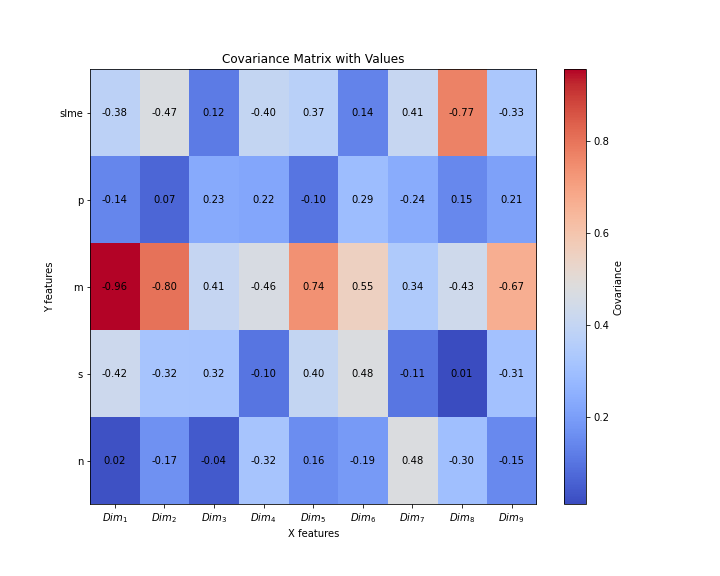
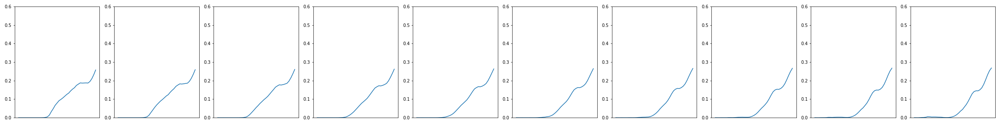
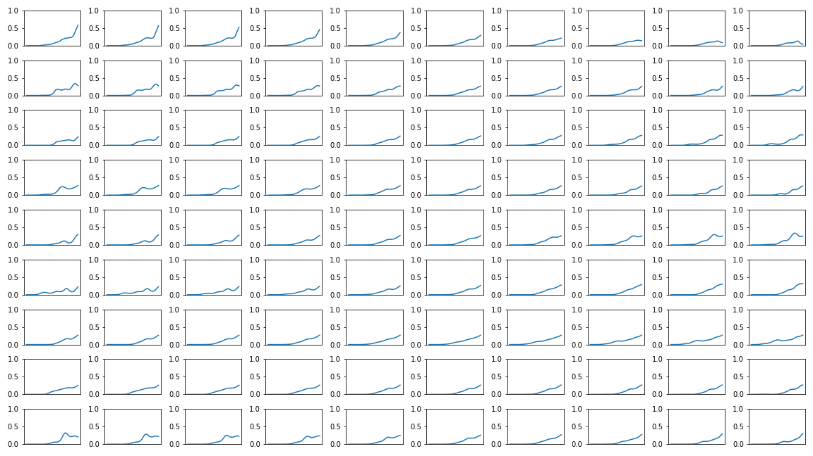
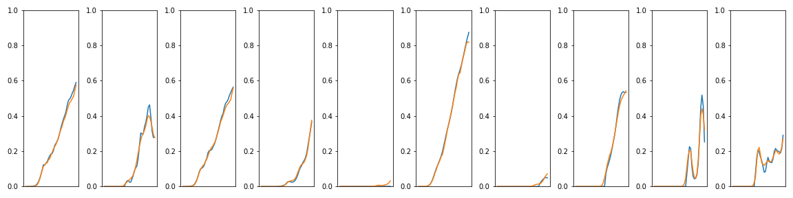

# material_discovery

# Covariance matrix

# Latent traversals from mean in the latent space

* Traversals of a dimension that is highly correlated with SLME

* Traversals across all dimensions

# Reconstruction results

* Reconstruction

